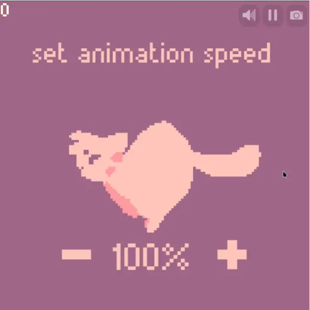

An example of how to draw an animation (and manage its state), along with an example of how to create basic UIs.

It includes:
- An [AnimationPlayer](./src/animation/player.mews) clowder for playing + managing animations.
- Two [UI utility clowders](./src/ui/) for managing buttons and text.

The animation speed can be changed by interacting with the `+` and `-` buttons!

