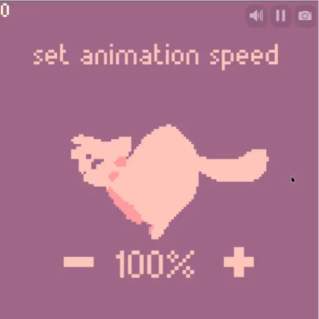

A collection of example projects written in [Mewlix](https://github.com/kbmackenzie/mewlix), a cat-themed esoteric programming language.

The projects are, in order:

1. [Hello World][1]: The classic *"hello world"* example.
2. [Drawing][2]: Drawing a static image.
3. [Animation][3]: Basic frame animation.
4. [Keyboard + Mouse][4]: Listening for keyboard & mouse input.
5. [Playing Sound][5]: Example for playing sound.
6. [Fizz Buzz][6]: A solution to the classic *"Fizz Buzz"* problem.
7. [99 Bottles][7]: The classic *"99 Bottles of Beer"* program, with some thematic flare.
8. [Snake Game][8]: A cat-themed clone of the classic Snake Game.
9. [Animation + UI][9]: Animation + UI rendering example.
10. [Dice Roller][10]: A simple dice roller.
11. [Quine][11]: A Quine program written in Mewlix.
12. [Brainf\*ck Interpreter][12]: A simple Brainf\*ck interpreter.

  
  
  
  

[1]: ./01&#32;-&#32;hello&#32;world
[2]: ./02&#32;-&#32;drawing
[3]: ./03&#32;-&#32;animation
[4]: ./04&#32;-&#32;keyboard&#32;+&#32;mouse
[5]: ./05&#32;-&#32;playing&#32;sound
[6]: ./06&#32;-&#32;fizzbuzz
[7]: ./07&#32;-&#32;99&#32;bottles
[8]: ./08&#32;-&#32;snake&#32;game
[9]: ./09&#32;-&#32;animation&#32;+&#32;ui
[10]: ./10&#32;-&#32;dice&#32;roller
[11]: ./11&#32;-&#32;quine
[12]: ./12&#32;-&#32;bf&#32;interpreter
